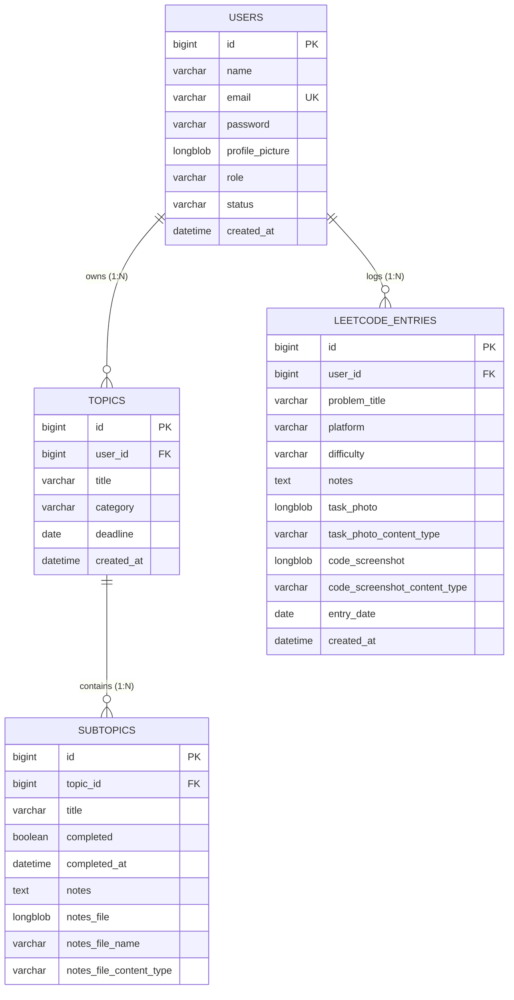

# 🗄️ Database Schema & Data Modeling

This document details the relational database design, table schemas, entity relationships, constraints, and data access optimization strategies used in **Momentum Learning**.

---

## 📌 Database Overview
- **Database Engine**: MySQL 8.0+
- **Storage Engine**: InnoDB (ACID Compliant)
- **Character Set**: `utf8mb4`
- **Collation**: `utf8mb4_unicode_ci`
- **ORM Framework**: Spring Data JPA / Hibernate 6.x
- **Schema Management Strategy**: `spring.jpa.hibernate.ddl-auto=update`

---

## 📊 Entity Relationship Diagram (ERD)



---

## 📋 Database Table Specifications

### 1. `users` Table
Stores registered platform users, security credentials, user roles, and profile settings.

| Column Name | Data Type | Nullable | Key / Unique | Default | Description |
|---|---|---|---|---|---|
| `id` | `BIGINT` | No | Primary Key | Auto Increment | Unique user identifier |
| `name` | `VARCHAR(255)` | No | None | None | User full name |
| `email` | `VARCHAR(255)` | No | Unique Key | None | Login email address |
| `password` | `VARCHAR(255)` | No | None | None | BCrypt hashed password string |
| `profile_picture` | `LONGBLOB` | Yes | None | `NULL` | Binary avatar image payload |
| `role` | `VARCHAR(50)` | No | None | `'USER'` | Access role (`USER`, `ADMIN`) |
| `status` | `VARCHAR(50)` | No | None | `'ACTIVE'` | Account status (`ACTIVE`, `INACTIVE`) |
| `created_at` | `DATETIME(6)` | No | None | Current Time | Account creation timestamp |

---

### 2. `topics` Table
Represents top-level study modules or learning goals created by a user.

| Column Name | Data Type | Nullable | Key / Unique | Default | Description |
|---|---|---|---|---|---|
| `id` | `BIGINT` | No | Primary Key | Auto Increment | Topic unique identifier |
| `user_id` | `BIGINT` | No | Foreign Key (`users.id`) | None | Owner user ID |
| `title` | `VARCHAR(255)` | No | None | None | Topic title |
| `category` | `VARCHAR(255)` | Yes | None | `NULL` | Topic category tag |
| `deadline` | `DATE` | Yes | None | `NULL` | Planned completion date |
| `created_at` | `DATETIME(6)` | No | None | Current Time | Creation timestamp |

**Foreign Key Constraint**:
```sql
CONSTRAINT fk_topics_user FOREIGN KEY (user_id) REFERENCES users(id) ON DELETE CASCADE;
```

---

### 3. `subtopics` Table
Represents individual sub-tasks or chapters belonging to a parent topic.

| Column Name | Data Type | Nullable | Key / Unique | Default | Description |
|---|---|---|---|---|---|
| `id` | `BIGINT` | No | Primary Key | Auto Increment | Subtopic unique identifier |
| `topic_id` | `BIGINT` | No | Foreign Key (`topics.id`) | None | Parent topic ID |
| `title` | `VARCHAR(255)` | No | None | None | Subtopic name |
| `completed` | `BOOLEAN` | No | None | `FALSE` | Completion status boolean |
| `completed_at` | `DATETIME(6)` | Yes | None | `NULL` | Completion timestamp |
| `notes` | `TEXT` | Yes | None | `NULL` | Markdown or plain text notes |
| `notes_file` | `LONGBLOB` | Yes | None | `NULL` | Attached document binary |
| `notes_file_name` | `VARCHAR(255)` | Yes | None | `NULL` | Original filename |
| `notes_file_content_type` | `VARCHAR(100)` | Yes | None | `NULL` | MIME type (e.g. `application/pdf`) |

**Foreign Key Constraint**:
```sql
CONSTRAINT fk_subtopics_topic FOREIGN KEY (topic_id) REFERENCES topics(id) ON DELETE CASCADE;
```

---

### 4. `leetcode_entries` Table
Logs daily competitive programming submissions and study solution media.

| Column Name | Data Type | Nullable | Key / Unique | Default | Description |
|---|---|---|---|---|---|
| `id` | `BIGINT` | No | Primary Key | Auto Increment | Entry identifier |
| `user_id` | `BIGINT` | No | Foreign Key (`users.id`) | None | Owner user ID |
| `problem_title` | `VARCHAR(255)` | No | None | None | LeetCode problem title |
| `platform` | `VARCHAR(100)` | Yes | None | `'LeetCode'` | Platform name |
| `difficulty` | `VARCHAR(50)` | Yes | None | `'MEDIUM'` | Difficulty (`EASY`, `MEDIUM`, `HARD`) |
| `notes` | `TEXT` | Yes | None | `NULL` | Solution notes |
| `task_photo` | `LONGBLOB` | Yes | None | `NULL` | Task diagram / whiteboarding photo |
| `task_photo_content_type` | `VARCHAR(100)` | Yes | None | `NULL` | MIME type of photo |
| `code_screenshot` | `LONGBLOB` | Yes | None | `NULL` | Solution code screenshot binary |
| `code_screenshot_content_type` | `VARCHAR(100)` | Yes | None | `NULL` | MIME type of screenshot |
| `entry_date` | `DATE` | No | None | None | Practice solution date |
| `created_at` | `DATETIME(6)` | No | None | Current Time | Log creation timestamp |

**Foreign Key Constraint**:
```sql
CONSTRAINT fk_leetcode_user FOREIGN KEY (user_id) REFERENCES users(id) ON DELETE CASCADE;
```

---

## ⚡ Indexing & Performance Optimization

To ensure fast query execution even with large datasets, the following indexing strategies are implemented:

1. **Foreign Key Indexes**:
   - `idx_topics_user_id` on `topics(user_id)` -> Fast fetch of user topics.
   - `idx_subtopics_topic_id` on `subtopics(topic_id)` -> Quick child subtopic lookups.
   - `idx_leetcode_user_id` on `leetcode_entries(user_id)` -> Fast retrieval of user practice history.

2. **Date Range & Analytics Indexes**:
   - `idx_leetcode_user_entry_date` on `leetcode_entries(user_id, entry_date)` -> Optimizes activity calendar heatmaps and streak calculations.
   - `idx_subtopics_completed_at` on `subtopics(completed_at)` -> Speeds up recent activity analytics feeds.

3. **BLOB Optimization**:
   - Binary fields (`LONGBLOB`) are lazily fetched in JPA entities to prevent loading large byte payloads during list queries. Dedicated REST endpoints serve image/file byte downloads.
